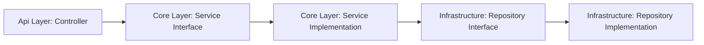

# 🏗️ Architecture Overview

To follow best practices in C# development, this project adopts a **layered architecture**. After some research (and a few cups of coffee ☕), here's the structure I landed on:

## 🗂️ Project Structure

Each part of the application is split into logical projects:

- **Api** 🚪
- **Core** 🧠
- **Infrastructure** 🏢
- **Test** (Unit & Integration) 🧪  
    > _Why separate unit and integration tests? More on that later!_

---

### **Api Layer** 🚪

- Handles incoming HTTP requests.
- Acts as the entry point (`Program.cs`).
- Defines controllers for each endpoint.
- References both **Core** and **Infrastructure** for dependency injection.
- Defines DTOs and binds data to pass to the service layer.

---

### **Infrastructure Layer** 🏢

- Manages connections to external resources (especially the database).
- Handles database migrations (design time).
- Contains concrete repository implementations (only this layer talks to the database via Entity Framework).
- Does **not** reference other projects.
- Defines entity models.

---

### **Core Layer** 🧠

- Contains business logic.
- Throws business exceptions.
- References **Infrastructure** to use repository implementations.

---

## 🔗 Layer Interaction

---

## 🧩 Dependency Injection (DI)

- A core feature of ASP.NET Core.
- Classes are registered with the DI container (no manual instantiation!).
- The `IHostBuilder` manages services and creates the `IHost`.
- Dependencies flow downward:  
    _Service needs Repository, Repository needs DbContext._

---

> _Project name is still TBD!_ 🚧

---

### 🤔 Where Should DTOs Be Constructed?

This has been a bit of an internal debate (me vs. myself 😅). After consulting my AI partner, here are the main options:

1. **Service Layer (Core Project)**  
   - DTOs are defined inside the core layer.  
   - **Trade-off:** Not ideal, since DTOs are public-facing and not business rules.

2. **Separate Contract Project**  
   - Create a new project (let's call it `Contract`) to define DTOs and handle their construction.  
   - Both **Core** and **Api** reference `Contract`.  
   - **Trade-off:** Great for larger projects, but adds complexity to project management.

3. **Api Layer**  
   - Keep DTOs in the API layer.  
   - **Trade-off:** Simplest approach, but means returning entities from the service layer and mapping to DTOs in controllers. Not the most efficient, as the whole entity is exposed to the API layer.

Each option has its pros and cons. For now, I'm leaning towards keeping things simple, but open to revisiting as the project grows! 🚀