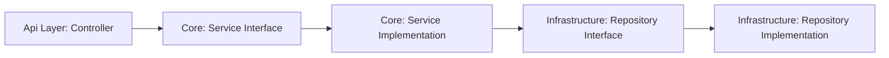

# 📦 Parcel Management System

Welcome to the **Parcel Management System**!  
A demonstration of modern backend and frontend engineering practices using **.NET (C#)** and **Angular**.  
Crafted by [qawitherev](https://github.com/qawitherev) to showcase domain-driven design, layered architecture, and sleek, scalable code. ✨

---

## 🖥️ Tech Stack

- **Backend**: C# (.NET), Clean/Layered Architecture, Dependency Injection, Entity Framework (planned), Robust Validation.
- **Frontend**: Angular (v20+), CLI workflows, Modular components.
- **Tooling**: Automated restore/build/test via `dotnet` CLI, Angular CLI for rapid UI development.

---

## 🚀 Key Capabilities

- 📦 **Parcel lifecycle management**: Creation, updates, status transitions.
- 🔄 **Assignment workflows**: Hand off parcels to couriers or depots.
- 🔍 **Search & listing**: Filter by status, recipient, date.
- 📝 **Audit-friendly**: Status history & timestamps for full traceability.
- 🧱 **Extensible**: Easily integrate with labels, notifications, webhooks.

---

## 🏗️ Architecture Overview

### 🗂️ Project Structure

- **Api** 🚪: HTTP entry point, controllers, DTO binding.
- **Core** 🧠: Business logic, domain rules, service orchestration.
- **Infrastructure** 🏢: Data persistence, migrations, repository implementations.
- **Test** 🧪: Unit & integration coverage for reliability.



### Clean separation keeps the domain pure and the system testable and maintainable.

---

## 📁 Repository Structure

```text
/
├─ parcel-management-system.sln     # Solution entry point
├─ src/                            # Application source (all projects)
├─ readme/                         # Docs, diagrams, notes
├─ frontend/                       # Angular UI
└─ dotnet-install.ps1              # .NET SDK bootstrap
```

---

## 🏁 Getting Started

### Backend (.NET)

```bash
git clone https://github.com/qawitherev/parcel-management-system.git
cd parcel-management-system
dotnet restore parcel-management-system.sln
dotnet build parcel-management-system.sln -c Release
dotnet run --project src/ParcelManagement.Api
dotnet test parcel-management-system.sln -c Release
```

### Frontend (Angular)

```bash
cd frontend
npm install
ng serve
```
Open [http://localhost:4200](http://localhost:4200) in your browser!

---

## 📝 Example Scenarios

- ✍️ Create parcels with sender/recipient details.
- 🔄 Update status as parcels move through delivery.
- 👥 Assign/unassign handlers (couriers, facilities).
- 🔎 Query parcels for dashboards/operations.
- 📊 Generate delivery metrics.

---

## 🏆 Quality & Maintainability

- 🧪 Testable layers, framework-agnostic domain.
- 🧱 Extensible workflows & integrations.
- 👀 Observability-ready logging.
- ⚙️ Config-first: environment isolation.

---

## 🗺️ Roadmap

- 💾 Add database persistence.
- ⏳ Background processing (async tasks).
- 📤 Outbound integrations (labels, tracking).
- 🔐 Authentication/authorization.
- 📑 OpenAPI/Swagger docs.

---

## 📚 Learning & Docs

- Explore the `/readme/` and `/frontend/readme/` folders for in-depth docs, architecture decisions, and Angular tips!
- _Each doc offers insights from real-world development and design choices._

---

## 📄 License

Check the repository for license information before reuse.

---

## 🙏 Credits

Built by [qawitherev](https://github.com/qawitherev) as a showcase of practical .NET and Angular skills for production-grade applications.

---

> 🚀 Dive in, explore, and let the code speak for itself!