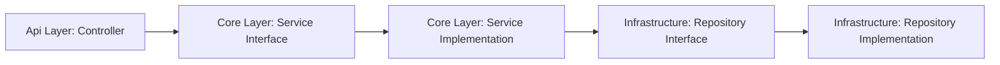

# 📦 Parcel Management System

A modern .NET-based parcel management system showcasing best practices in software architecture and development.

## 🏗️ Architecture

This project follows Clean Architecture principles with a clear separation of concerns across three layers:

- **Api Layer** 🚪: Entry point for HTTP requests, controllers, and DTOs
- **Core Layer** 🧠: Business logic and domain models
- **Infrastructure Layer** 🏢: External concerns like database access

## 💡 Design Patterns

- **Repository Pattern**: Abstracts data access logic
- **Dependency Injection**: Leverages ASP.NET Core's built-in DI container
- **Specification Pattern**: Used for querying data with complex business rules
- **Factory Pattern**: Utilized for database context creation
- **Service Pattern**: Encapsulates business logic in dedicated service classes

## 🔒 Authentication & Security

- **JWT-based Authentication**: Secure token-based auth system
- **Password Hashing**: Uses ASP.NET Core Identity's password hasher
- **Role-based Authorization**: Supports multiple user roles (Admin, Resident, ParcelRoomManager)
- **Token Service**: Custom implementation for JWT generation and validation

## 💾 Data Access & ORM

- **ORM**: Entity Framework Core
- **Database**: MySQL with Pomelo.EntityFrameworkCore.MySql provider
- **Features**:
  - Code-first migrations
  - Fluent API for entity configuration
  - Strong typing with proper column definitions
  - Unique constraints and indexing
  - Precision handling for decimal values

## 🎯 Industry Best Practices

- **Clean Architecture**: Clear separation of concerns
- **SOLID Principles**: Followed throughout the codebase
- **Async/Await**: Asynchronous programming patterns
- **Error Handling**: Proper exception handling and custom exceptions
- **Configuration Management**: Uses ASP.NET Core's configuration system
- **Testing**: Supports both unit and integration testing
- **Code Organization**: Well-structured project layout with clear responsibilities

## 🚀 Technical Showcase

This project demonstrates proficiency in:

- ✨ Modern .NET development
- 🏛️ Clean Architecture implementation
- 🔐 Security best practices
- 🗃️ Database design and ORM usage
- 📝 Code-first approach
- 🧪 Testing strategies
- 🛠️ API design and implementation

## 🛡️ Environment Support

- Development environment with user secrets
- Testing environment with separate configuration
- Production-ready setup