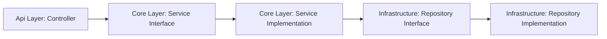

# 🏗️ Architecture Overview

To adhere to best practices in C# development, this project follows a **layered architecture**. After research and consideration, the following structure was chosen:

## 🗂️ Project Structure

Each component of the application is divided into logical projects:

- **Api** 🚪
- **Core** 🧠
- **Infrastructure** 🏢
- **Test** (Unit and Integration) 🧪  
    > _Note: The reason for separating unit and integration tests will be discussed later._

---

### **Api Layer** 🚪

- Handles incoming HTTP requests.
- Serves as the application's entry point (`Program.cs`).
- Defines controllers for each endpoint.
- References both **Core** and **Infrastructure** for dependency injection.
- Defines DTOs and performs data binding to pass data to the service layer.

---

### **Infrastructure Layer** 🏢

- Manages connections to external resources (especially the database).
- Handles database migrations (performed during design time).
- Contains concrete implementations of repository interfaces (only this layer communicates with the database via Entity Framework).
- Does **not** reference other projects.
- Defines entity models.

---

### **Core Layer** 🧠

- Contains business logic.
- Throws business exceptions.
- References **Infrastructure** to use repository implementations.

---

## 🔗 Layer Interaction

---

## 🧩 Dependency Injection (DI)

- A key feature of ASP.NET Core.
- Classes are registered with the DI container instead of being instantiated manually.
- The `IHostBuilder` manages services and creates the `IHost`.
- Dependencies flow downward:  
    _Service needs Repository, Repository needs DbContext._

---

> _Project name is still under consideration._ 🚧